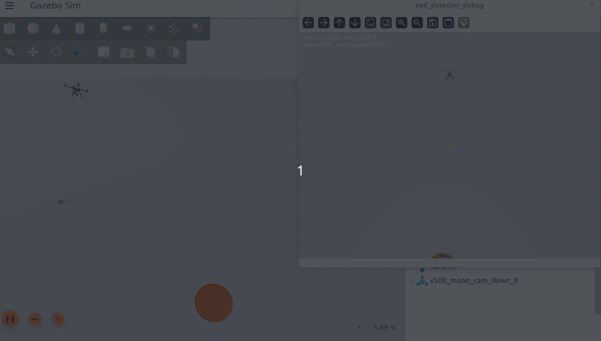

# 🚁 ROS 2 + PX4 Precision Landing with EKF (Vision-Based)

## 📌 Overview

This project implements a **vision-based precision landing system** for a PX4 drone using **ROS 2**, **Gazebo**, and an **Extended Kalman Filter (EKF)**.

The drone:

* Executes a waypoint mission using offboard control
* Detects a **red landing pad** using a downward-facing camera
* Uses an **EKF to smooth noisy image measurements**
* Performs **closed-loop visual servoing**
* Aligns with the landing pad and performs a **controlled descent**
* Triggers a final autonomous landing

This project demonstrates a full autonomy pipeline:

```text
Perception → Estimation → Control → PX4 Execution
```

---

## 🎥 Demo

### Precision landing on red landing pad



* Mission execution
* Landing pad detection
* EKF smoothing
* Precision landing

---

## 🧠 System Architecture

```text
Gazebo Camera
   ↓
ros_gz_bridge
   ↓
/camera/image_raw
   ↓
pad_detector.py
   ↓
/landing_pad/measurement
   ↓
pad_tracker_ekf.py
   ↓
/landing_pad/state_estimate
   ↓
landing_manager.py
   ↓
/mission/target_position
   ↓
offboard_control.py
   ↓
PX4
```

---

## 🔧 Features

### ✈️ Offboard Control

* Position control via ROS 2 → PX4
* Continuous setpoint streaming
* Smooth waypoint tracking

### 🗺️ Mission Manager

* State machine-based mission execution:

  * TAKEOFF
  * WAYPOINT NAVIGATION
  * LANDING SEARCH
  * PRECISION LANDING
* Clean handoff to landing controller

### 🎯 Vision-Based Pad Detection

* HSV-based red color segmentation
* Contour filtering for robustness
* Normalized image error computation
* Real-time debug visualization

### 🧠 EKF-Based Tracking

* State: `[ex, ey, vex, vey]`
* Smooths noisy detections
* Handles temporary loss of visual input
* Provides stable control inputs

### 🛬 Precision Landing Controller

* Image-based feedback control
* Axis-mapped correction (camera → world frame)
* Alignment gating before descent
* Gradual descent control
* Final PX4 landing trigger

---

## 📦 Package Structure

```bash
drone_precision_landing_py/
├── launch/
│   └── precision_landing.launch.py
├── config/
│   ├── offboard_params.yaml
│   ├── mission_params.yaml
│   ├── pad_detector_params.yaml
│   ├── ekf_params.yaml
│   └── landing_params.yaml
├── drone_precision_landing_py/
│   ├── offboard_control.py
│   ├── mission_manager.py
│   ├── pad_detector.py
│   ├── pad_tracker_ekf.py
│   └── landing_manager.py
├── package.xml
└── setup.py
```

---

## ⚙️ Installation

### 1. Clone into workspace

```bash
cd ~/drone_ws/src
git clone <your_repo_url>
```

---

### 2. Build

```bash
cd ~/drone_ws
colcon build --packages-select drone_precision_landing_py --symlink-install
source install/setup.bash
```

---

## 🚀 Running the System

### 1. Start PX4 SITL + Gazebo

```bash
make px4_sitl gz_x500_mono_cam_down
```

---

### 2. Launch full autonomy stack

```bash
ros2 launch drone_precision_landing_py precision_landing.launch.py
```

---

## 🧪 Test Setup

* Place a **red landing pad** at the landing staging position (e.g. world origin `(0,0)`)
* The drone will:

  1. Take off
  2. Execute waypoint mission
  3. Return to staging area
  4. Detect the landing pad
  5. Align and descend
  6. Land autonomously

---

## 🔧 Key Parameters

### Landing speed tuning (`landing_params.yaml`)

```yaml
descent_step: 0.5
alignment_threshold: 0.12
alignment_hold_required: 3
landing_trigger_z: -2.0
```

---

### Debug window scaling (`pad_detector_params.yaml`)

```yaml
debug_window_scale: 0.5
```

---

## 🧠 Key Concepts Demonstrated

* Visual servoing
* Sensor fusion (vision + EKF)
* Coordinate frame mapping (image → world)
* State machine design
* Offboard control with PX4
* ROS 2 modular architecture

---

## ⚠️ Lessons Learned

* Image axes do **not directly map** to world axes → required calibration
* EKF improves stability but does not fix control logic errors
* Proper **controller handoff** between mission and landing is critical
* Sign and axis mapping are the most common failure points in vision control

---

## 🚀 Future Improvements

* YOLO-based landing pad detection
* Depth estimation for metric positioning
* Adaptive descent rate
* Yaw alignment with landing pad
* Multi-marker detection
* Real-world deployment on hardware

---

## 🧑‍💻 Author

**Saeed Jafari Kang**

* Robotics / Autonomous Systems
* ROS 2 + PX4 + Computer Vision
* GitHub: *(github.com/sjafarik)*

---

## ⭐ Summary

This project demonstrates a **complete autonomous drone pipeline** combining:

* perception
* estimation
* control
* real-time robotics integration

and represents a strong foundation for **robotics software engineering roles**.
